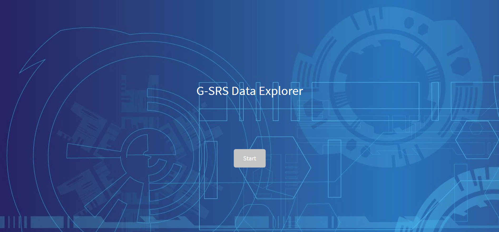
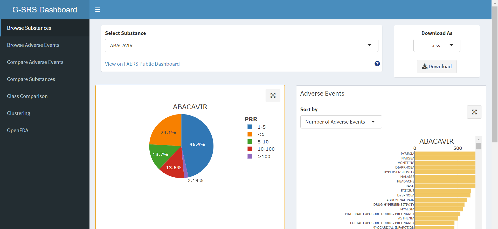

# G-SRS Dashboard

Data dashboard analyzing adverse event and substance data from FDA's Global Substance Registration System

## How to run
Create a folder with the above code and data files, which is everything except folder test-data, folder rsconnect/shinyapps.io/czhang2718, gsrs-pg1.png, and gsrs-loading.png. Load your data set into a variable 'dset' (commented out in line 41 of global.R). Make sure all packages are installed, then pressing Run should launch the dashboard.
